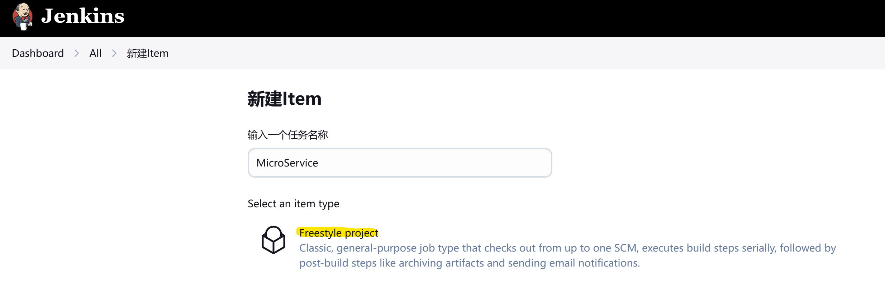
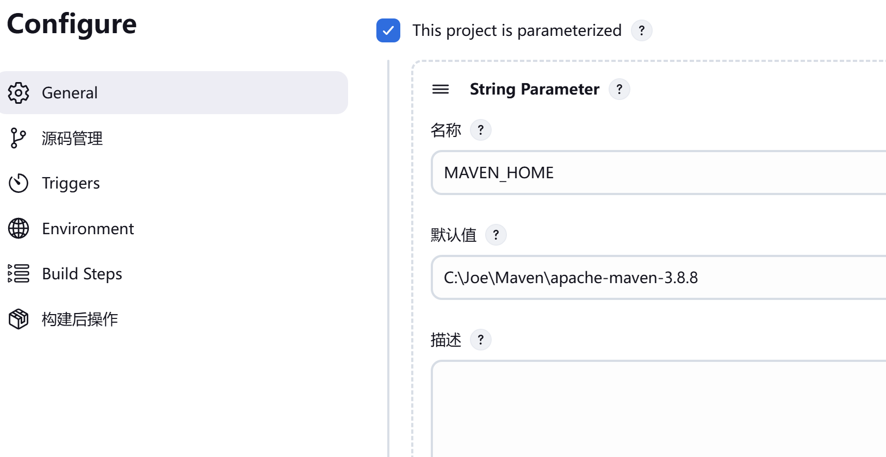
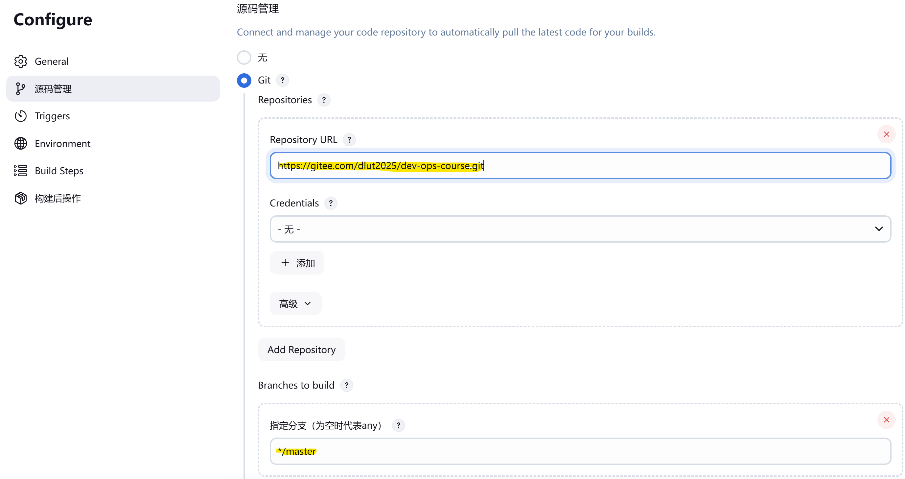
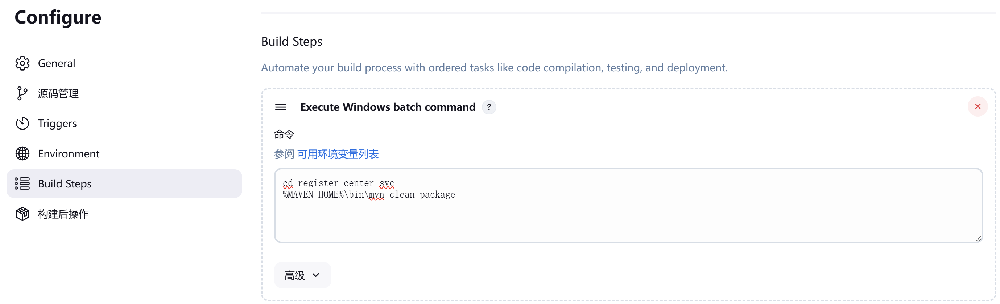
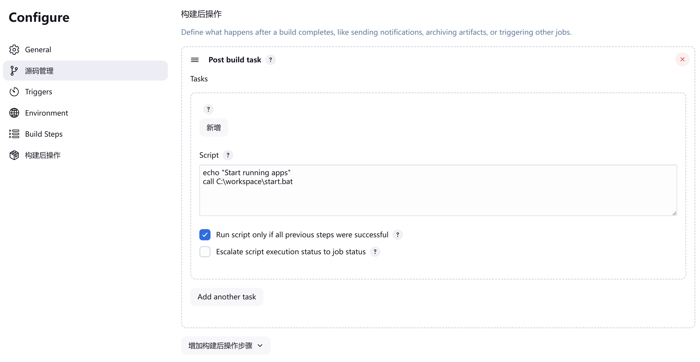
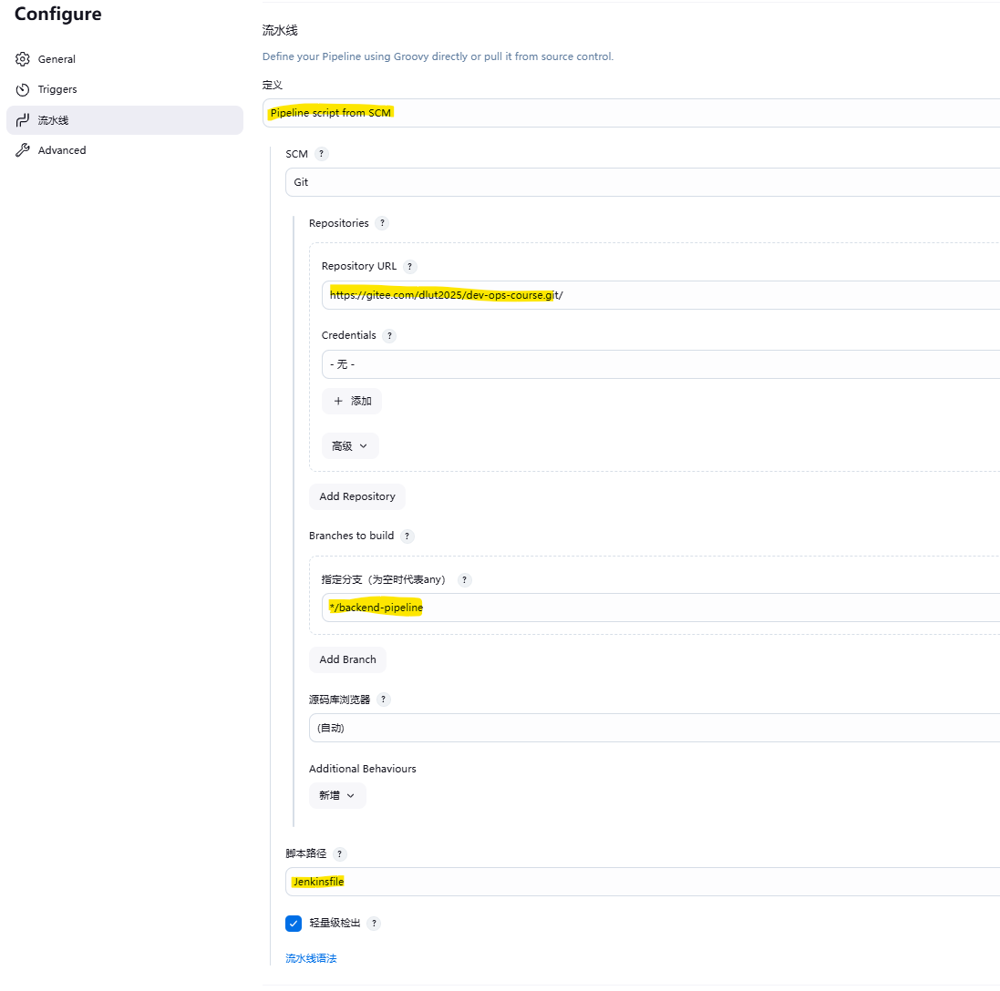

# 配置Jenkins任务

### 准备workspace文件夹

1. 在C盘根目录下创建名为"workspace"的文件夹，作为工作区

2. 在"workspace"文件夹内, 创建名为"jars"的文件夹,用于存储编译打包后的Spring Boot JAR包

3. 在"jars"文件夹中, 再创建一个名为"backup"的文件夹，用于备份上一个版本的Spring Boot JAR包

4. 在"workspace"下创建一个名为"start.bat"的文件用于启动所有微服务，代码如下

   ```bat
   @echo off
   start javaw -jar C:\workspace\jars\register-center-svc-0.0.1-SNAPSHOT.jar
   start javaw -jar C:\workspace\jars\client-svc-0.0.1-SNAPSHOT.jar
   start javaw -jar C:\workspace\jars\client-svc-8083-0.0.1-SNAPSHOT.jar
   start javaw -jar C:\workspace\jars\bwic-svc-0.0.1-SNAPSHOT.jar
   ```

5. 在"workspace"下创建一个名为"stop.bat"的文件用于停止所有微服务，代码如下
   ```bat
   @echo off
   taskkill /f /im javaw.exe
   ```

​	/f : 强制终止

​	/im: `/IM` 代表 “映像名称”（Image Name），也就是进程的可执行文件名称

### 配置Freestyle微服务构建任务

#### 1. 创建一个Freestyle project	

   

   

#### 2. 点击配置，首先添加一个"MAVEN_HOME"参数用来指定maven的位置

   

#### 3. 配置DevOps源码地址(https://gitee.com/dlut2025/dev-ops-course.git),并指定master分支

   

#### 4. 在"Build Steps"里创建4个"Execute Windows batch command"步骤用来打包四个对应的服务


   ```bat
   // 打包注册中心
   cd register-center-svc
   %MAVEN_HOME%\bin\mvn clean package
    
   // 微服务8081
   cd client-svc
   %MAVEN_HOME%\bin\mvn clean package
    
   // 微服务8083
   cd client-svc8083
   %MAVEN_HOME%\bin\mvn clean package
    
   // 服务8082
   cd bwic-svc
   %MAVEN_HOME%\bin\mvn clean package
   ```



#### 5. 在"Build Steps"里创建一个"Execute Windows batch command"步骤用来停掉已启动的服务
   ```bat
   echo "停掉正在运行的服务"
   call C:\workspace\stop.bat
   exit 0
   ```

#### 6. 在"Build Steps"里创建一个"Execute Windows batch command"步骤来备份所有的Jar
   ```bat
   echo "备份目标文件夹下文件"
   move "C:\workspace\jars\*" "C:\workspace\jars\backup"
   exit 0
   ```

#### 7. 在"Build Steps"里创建一个"Execute Windows batch command"步骤来把已打包好的JJar包放到工作区文件夹下
   ```bat
   echo "Copy Files to target folder"
   robocopy register-center-svc\target C:\workspace\jars register-center-svc-0.0.1-SNAPSHOT.jar
   robocopy client-svc8083\target C:\workspace\jars client-svc-8083-0.0.1-SNAPSHOT.jar
   robocopy client-svc\target C:\workspace\jars client-svc-0.0.1-SNAPSHOT.jar
   robocopy bwic-svc\target C:\workspace\jars bwic-svc-0.0.1-SNAPSHOT.jar
   echo "Copy Files to target folder - Done"
   exit 0
   ```

到这一步服务构建完成，下面开始启动服务
#### 8. 在构建后操作里添加一个"Post Build task"用来启动服务
   ```bat
   echo "Start running apps"
   call C:\workspace\start.bat
   ```
   

### 配置Pipeline构建任务

#### 1. 创建一个Pipeline项目

#### 2. 点击配置，首先添加一个"MAVEN_HOME"参数用来指定maven的位置

   

#### 3. 流水线选择"Pipeline script from SCM" 

####         脚本路径填入Jenkinsfile

####         配置Git地址并指定pipeline分支(https://gitee.com/dlut2025/dev-ops-course.git branch : */backend-pipeline )

   